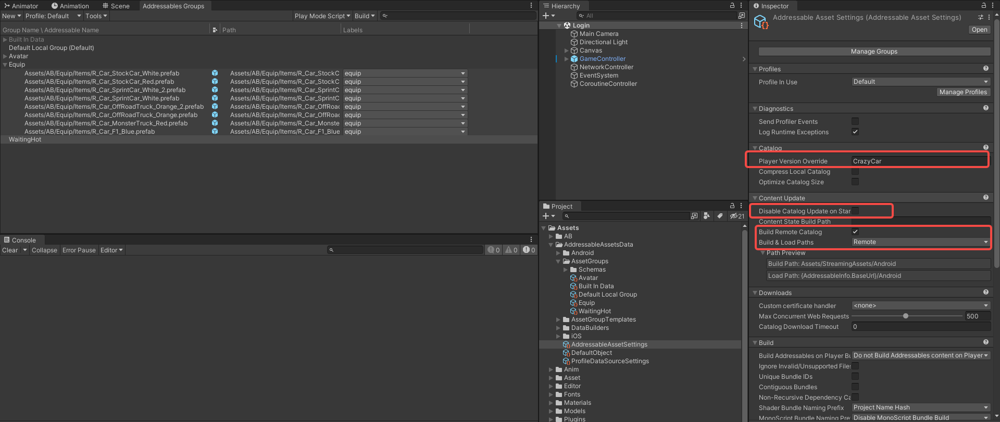
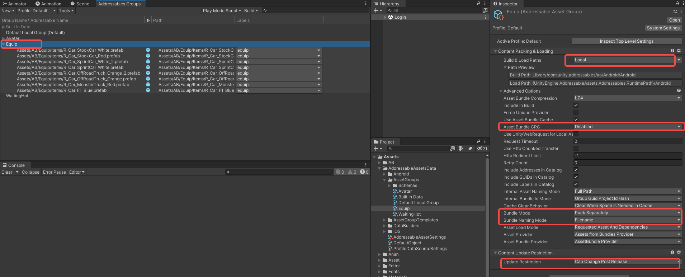
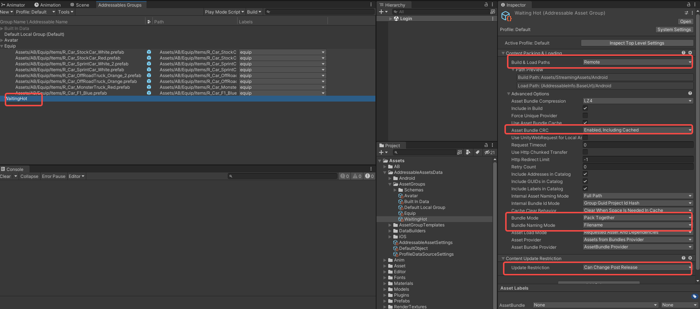

# 资源热更新方案设计

此文档需要对Unity的Addressable有清楚的了解，如果是小白建议先阅读相关文章，最好进行Dome测试，以了解相关其基本原理。

**Addressable**可以理解为是在Asset Bundle的基础上，提供了一个管理系统可以让我们更好的组织和管理我们的资源。

**Addressable**的本质是Unity想要主推的**CCD**(*资源流式分发*)的技术基础，所以它的更新方案偏重于线上更新，对于一般游戏并不适应。

对于一般游戏的诉求如下：正常情况新装备可以随新版本一同发行，此时不希望通过资源更新的方式获取新装备；但是如果线上装备贴图错误或者有活动装备需要紧急上新，都是需要能够单独热更，即只更新此装备；以上为产品诉求，但是对于开发来说，不希望在装备随版本一同发行的情况下，还要再打一个资源包发至CDN，只希望真正更新资源时再从线上拉取catalog判断是否需要更新资源。

基于以上诉求设计Addressable更新方案：

```mermaid
graph LR
start-->开启游戏-->是否热更资源{是否热更资源}--Yes-->拉取CDN-Catalog-->本地检测是否需要更新{本地检测是否需要更新}--Yes-->获取CDN对应Addressable资源-->End;
是否热更资源--No-->获取本地Catalog-->End;
本地检测是否需要更新--No-->本地已经更新过-->End;
```

基于以上方案，需要在Addressable调整的参数如下：



*Player Version Override*：不写的话，unity会使用默认的名字，但是这个名字会很长

*Disable Catalog Update On Startup*：这里是接到接口后，再动态赋值remote load path远程加载地址，之后再初始化

*Build Remote Catalog 、Build & Load Paths*：开启线上更新


*Remote.BuildPath*： Assets/StreamingAssets/[BuildTarget] 将热更包打至此处

Remote.LoadPath：{AddressableInfo.BaseUrl}/[BuildTarget] 动态赋值BaseUrl此变量来改写读取*Addressable*的位置，即为了满足，再没有开启更新的时候，读取本地的**Catalog**

```c#
    public void SetUpdateInfo(Action finish) {
       CoroutineController.manager.StartCoroutine(this.GetSystem<INetworkSystem>().POSTHTTP(url: this.GetSystem<INetworkSystem>					().HttpBaseUrl + RequestUrl.addressableUrl,
                succData: (data) => { 
                    if ((bool)data["is_on"]) {
                        AddressableInfo.BaseUrl = (string)data["url"];
                    } else {
                        AddressableInfo.BaseUrl = Application.streamingAssetsPath;
                    }
                    finish.Invoke();
                }));
    }
```



Build & Load Paths：此分组设置成本地加载，如果新装备跟随版本，则就可以直接放在此分组，使用本地加载

Asset Bundle CRC、Bundle Naming Mode：此处是为了实现不同计算机打出的资源包，都可以用于线上热更*(不同计算机即使资源相同，打出包的CRC以及Hash值都可以不一样)*，比如说：你用A计算机打出版本，发布至应用商店，然后需要更新资源，你用B计算机打出资源包以及Catalog(**Catalog也会记录本地资源位置**)，是不能给线上版本使用的，因为本地的资源路径以及CRC都变了，线上版本更新此Catalog后将无法加载本地资源。

Bundle Mode ：打成一个包，好管理



Build & Load Paths：此分组设置成远程分组，如果有要更新的资源，需要放至此分组

Asset Bundle CRC：远程分组最好进行CRC校验，即使不同计算机打包不一样，也无所谓，因为每次更新资源此包都会被整包重新下载


打包直接使用**New Build**即可，无用进行**Update a previous Build**